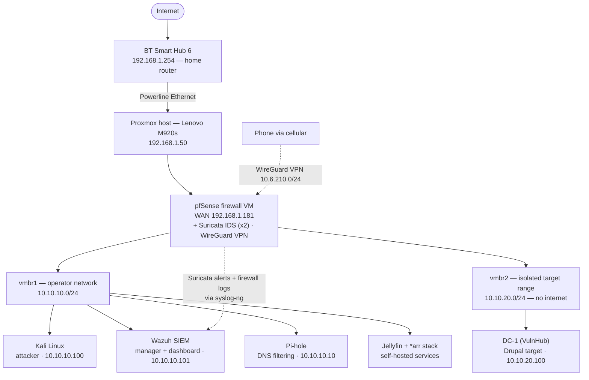

# SOC Detection Lab — Building and Testing a Detection Pipeline (pfSense · Suricata · Wazuh)

A home security-operations lab: network segmentation, custom IDS rules, and a Wazuh SIEM — then a full attack against a live target to measure what the monitoring actually catches and misses.

This started as a way to get hands-on with the things a course can't really teach — segmenting a network, writing IDS rules, wiring detections into a SIEM, breaking and fixing a VPN, and watching an attack light up (or slip past) my own monitoring in real time. It ended up as a working detection stack that I then attacked end to end, from first scan to root, and analysed from the defender's side.

Everything runs on a single Lenovo ThinkCentre M920s (i5-8500, 24 GB RAM) under Proxmox. The lab is walled off from my home network behind pfSense, watched by Suricata on two segments, filtered by Pi-hole, aggregated into a Wazuh SIEM, and reachable remotely over WireGuard. A deliberately vulnerable target sits on its own isolated segment, and I attack it from a separate Kali box.

> Private, isolated lab built for learning. No keys, tokens, or live configs are committed — just documentation and screenshots. Internal `10.x` / `192.168.x` addresses are shown because they're private and help explain the topology.

## Why I built it

I wanted a realistic environment to practise both sides — defending a network and attacking it — and to actually *prove* things work instead of assuming they do. Every phase ends with a verification step: a scan that fires an alert, a ping that gets blocked, a DNS lookup that gets sinkholed, an exploit that trips a signature. The final phase is the point of the whole thing: a real intrusion, reconstructed from the sensors, to find out exactly where the monitoring succeeds and where it goes blind.

## How it's laid out

The home router hands off to pfSense's WAN, and pfSense firewalls and NATs the two internal segments (so the lab is effectively double-NAT). A default-deny rule stops the operator network reaching my home network — confirmed by pinging my home gateway from Kali and watching it fail 100% while internet access still worked. The target range (`vmbr2`) is sealed tighter still: it can reach only the attacker and the SIEM, with everything else — internet, home network, other lab hosts — blocked and logged.

## What's running

| Layer | Tech | Address |
|---|---|---|
| Hypervisor | Proxmox VE 9.1 (Debian 13) | 192.168.1.50 |
| Firewall / router / IDS / VPN | pfSense CE 2.8.1 + Suricata (x2) + WireGuard | 10.10.10.1 |
| SIEM | Wazuh (manager, indexer, dashboard) | 10.10.10.101 |
| DNS filtering | Pi-hole (Quad9 + DNSSEC) | 10.10.10.10 |
| Attacker | Kali Linux 2026.1 | 10.10.10.100 |
| Target (isolated) | DC-1 (VulnHub) — Debian 7 / Drupal 7 | 10.10.20.100 |
| Self-hosted services | Jellyfin + *arr stack | 10.10.10.x |

## What I actually did (and verified)

### Phase 1 — Proxmox host

Installed Proxmox VE 9.1 on the M920s. Ran into the new deb822 repo format — disabling a repo needs `Enabled: false`, not commenting out the components, which threw "malformed entry" errors until I worked it out. Added an XFCE desktop for local access. I run root auto-login for convenience, which I know widens the local attack surface — I've noted it as a trade-off; hardening is on the roadmap.

### Phase 2 — Network bridges

Created `vmbr1` as the lab switch so pfSense handles all routing, NAT, DHCP and DNS rather than Proxmox. Putting an IP + NAT on the bridge would have created a second router fighting pfSense.

One thing to be straight about, since the config evolved: `vmbr1` was originally left with no IP at all. Later, so the Proxmox host could reach the Wazuh manager on the lab network, the host was given a single address on `vmbr1` (`10.10.10.2`) with the gateway field deliberately left blank. That keeps the host reachable on the lab segment without turning it into a router — its own route out still goes via `vmbr0`, and pfSense still provides all routing, NAT, DHCP and firewalling. The one consequence is that lab hosts can now reach the Proxmox host at `10.10.10.2`; every machine on that segment is trusted, and the deliberately vulnerable target lives on a separate segment with no path to it (see Phase 8). Locking down host access is a hardening item.

### Phase 3 — pfSense, Suricata, WireGuard (the core)

- **pfSense CE 2.8.1:** WAN via DHCP from my BT hub, LAN `10.10.10.1`, DHCP pool for the lab, default-deny lab → home.
- **Suricata** in IDS (alert-only) mode on the LAN with ET Open rules plus a few of my own. I wrote SID `1000001` to catch nmap SYN scans, ran `nmap -sS` from Kali against pfSense, and watched my own rule fire.
- **WireGuard** for remote access from my phone, with DuckDNS tracking my changing home IP. The interesting bug: the peer was saved to config but never synced to the live interface — I traced it with `wg show`, `ifconfig` and the filter log over SSH, and fixed it by forcing a re-sync. Also caught an interface left on "None" IPv4 that would have silently broken tunnel routing.

### Phase 4 — Pi-hole

DNS filtering on `10.10.10.10`, Quad9 upstream with DNSSEC. Beyond ad-blocking, this gives me one place to see every domain a lab host talks to — handy for spotting C2-style callbacks. Verified: `doubleclick.net` → `0.0.0.0`, `google.com` resolves normally.

### Phase 5 — Wazuh SIEM

Built a dedicated Ubuntu Server VM on the lab network (`10.10.10.101`) and installed Wazuh all-in-one — the manager (analysis engine), the indexer (event store), and the dashboard (the web UI). At this point the SIEM was live but blind: it had no data sources yet, so the dashboard correctly showed zero agents and zero events. That clean "before" state is what makes everything that lands on it later meaningful.

### Phase 6 — Kali attacker

Kali 2026.1 on the lab network with CPU passthrough. It reaches the internet through pfSense but not my home network — exactly the isolation I was after.

### Phase 7 — Feeding Suricata and pfSense into Wazuh

This is where the SIEM stopped being blind. pfSense is a hardened FreeBSD appliance where a Wazuh agent isn't supported, so the integration is agentless: pfSense forwards its logs over the network to a syslog receiver on the Wazuh manager. I installed `syslog-ng` on pfSense as a relay handling two inputs — pfSense's own system and firewall logs, and Suricata's `eve.json` read straight off disk — both forwarded to Wazuh. On the Wazuh side I wrote a custom decoder to unwrap the JSON that pfSense nests inside a syslog header, and a rule (ID `100101`) that raises an alert only on genuine IDS detections.

This phase was mostly debugging, and each fault taught something:

- **A scan that produced no alert** turned out to be architectural, not a misconfiguration — two hosts on the same virtual bridge talk directly to each other, so the traffic never crosses pfSense and Suricata can't see it. This finding is exactly why the target later got its own separate, routed segment.
- **Silent syslog failure** — a known pfSense issue where the log daemon stops and never retries. The config looked perfect; `tcpdump` showed zero packets leaving. Re-saving the settings restarted it, and I added Service Watchdog so it self-heals.
- **A missing hostname** in pfSense's syslog header stopped Wazuh's decoder matching — `syslog-ng` fixed it by applying strict formatting.
- **A case-sensitivity typo** in the generated `syslog-ng` config took down all logging at once, because the service refuses to start on any invalid reference. The lesson: check the generated config file, not just the web form.
- **A decoder pattern mismatch** and a **duplicate rule ID** each broke the pipeline in different ways, both traced with `wazuh-logtest` until every field — signature, IPs, ports, protocol — extracted cleanly.

One result I didn't expect but kept: Wazuh fired an alert when pfSense's own log daemon died. A silently dead log source looks identical to a quiet network, so a SIEM detecting the failure of its own telemetry is genuinely useful. The end state is a pipeline where an attack crosses the network, pfSense logs it and Suricata inspects it, `syslog-ng` normalises and forwards both streams, and Wazuh decodes them onto one dashboard — all persistent across reboots.

### Phase 8 — Isolated target range

Built the network the vulnerable target would live on, driven directly by the Phase 7 finding about same-segment traffic. A new bridge (`vmbr2`, `10.10.20.0/24`) was created and given no host IP at all — unlike the operator segment, the hypervisor has zero presence on this "risky" network. pfSense was given a third NIC on it and configured as the segment's gateway (`10.10.20.1`, static, no upstream), with its own DHCP pool.

The heart of the phase is three firewall rules governing what the target may initiate: allow it to reach the Wazuh manager (so an agent could report), allow it to reach Kali (so an exploit's reverse shell can call back — skip this and an exploit lands but the shell silently never arrives), and then block everything else, logged. That last rule is the isolation wall: no internet, no home network, no other lab hosts, not even pfSense's own web UI. Because pfSense evaluates firewall rules before NAT, the block holds even though outbound NAT exists. The result is a segment sealed to exactly two destinations — the attacker and the SIEM — with every escape attempt dropped and logged into the Phase 7 pipeline.

### Phase 9 — Suricata on the target range

A sealed, routed network still isn't a watched one. The key concept here is that in pfSense, Suricata is per-interface — each instance watches exactly one interface and nothing else, so the target segment needed its own sensor, created deliberately, rather than the existing LAN instance somehow covering it. I raised the pfSense VM to 4 GB first (a second instance roughly doubles Suricata's memory use), added an instance bound to the target interface in alert-only mode, enabled the same ET Open categories, and copied my six custom rules across by hand — they don't propagate between instances.

Testing it surfaced a subtlety worth understanding: scanning the target's gateway from Kali fired the *LAN* sensor, not the new one, and the new sensor stayed silent. That's correct — the traffic entered pfSense on LAN (where Kali lives), and the target segment was still empty, so there was nothing for its sensor to see. A sensor watching an empty network reports nothing. The real test had to wait until a live target existed.

### Phase 10 — Deploying the target (DC-1)

Put a real, deliberately vulnerable machine on the range. I chose **DC-1**, a VulnHub boot2root box running Drupal 7 on Debian 7, because it has a realistic web-application entry point tied to a named CVE and a clean recon-to-root path. It ships as a VirtualBox OVA, so I imported it into Proxmox with `qm importovf`, then gave it legacy-compatibility hardware (i440fx, SeaBIOS, SATA disk, e1000 NIC) so its 2015 kernel would boot — modern virtual hardware kernel-panics it. I verified the download's checksum before running it, since it's an intentionally vulnerable image.

It booted first try, pulled a DHCP lease at `10.10.20.100`, and came up with SSH, Apache/Drupal and rpcbind running. The first scan from Kali was the payoff of the whole build: it enumerated the services and fired both my custom SID `1000001` and an ET Open scan signature — and, exactly as expected from the Phase 9 ingress behaviour, those alerts landed on the LAN sensor (Kali's side) and flowed through to Wazuh with no extra configuration. A quick note on a known limitation surfaced here too: Wazuh's ATT&CK dashboard doesn't auto-classify these alerts, because they arrive through the custom decoder path rather than Wazuh's built-in tagged rules — so ATT&CK mapping is done by hand in the report, which is the more useful skill to show anyway.

### Phase 11 — The detection exercise (full attack, analysed from the defender's side)

The capstone: a complete attack against DC-1, start to finish, with Suricata left in alert-only mode so the defences *watched but didn't block* — the point being to measure what the monitoring sees, not to stop the attack. The attack ran over the network from Kali with no console access or credentials: recon, then web enumeration fingerprinting Drupal 7, then initial access via **Drupalgeddon2 (CVE-2018-7600)** for a shell as `www-data`, then post-exploitation that pulled database credentials out of Drupal's `settings.php`, then privilege escalation via a **SUID `find`** binary to full root, and finally an outbound test from the root shell to check the isolation held.

Reconstructing that purely from the sensors, the results were clear:

- **What was caught:** the reconnaissance fired my scan rule, and — the standout result — the exploitation tripped a signature that **named the exact CVE**. A defender would know not just that an attack happened, but precisely which exploit hit which application.
- **What contained it:** even with an attacker holding root, the target's attempts to reach the internet were **blocked and logged** — containment held under the worst case, and those blocked attempts are themselves an indicator of compromise.
- **The critical gap:** between the exploit alert and the blocked egress there's a silent window — and that's exactly when the attacker read credentials and escalated to root. None of it crossed the network, so the network IDS was structurally blind to it. The stack was strong at the perimeter and blind on the host.

The full analysis — the stage-by-stage detection coverage, the MITRE ATT&CK mapping, the gaps, and the recommendations — is in the detection report:

**➡️ [Blue Team Detection Report](reports/blue-team-detection-report.md)**

The headline conclusion is the kind of thing the whole lab was built to produce: the architecture observes attacks *crossing* the network but not attacker actions *inside* a host, and the single highest-value improvement would be host-based telemetry to close that gap.

## Honest limitations

- **Network-only visibility on the target.** There's no host agent on DC-1 (a modern Wazuh agent won't run on Debian 7), which is the direct cause of the host-level blind spot documented in Phase 11. Agentless syslog forwarding from the target would close it — recorded as an enhancement.
- **The Proxmox host sits on my home network**, not behind pfSense — normal for a single-box lab, but I'd move pfSense to its own hardware to gate the whole house.
- **Single-operator setup with root auto-login**; proper auth hardening (2FA, `fail2ban`, a non-root admin, backups) is the next area of work.
- **Suricata runs on the firewall**, which is clean for placement but limits how richly the SIEM can decode its alerts compared to a dedicated sensor host — a documented trade-off.

## Repo contents

- **`docs/`** — the full per-phase build writeups.
- **`reports/`** — the blue-team detection report from the Phase 11 exercise.
- **`configs/`** — sanitised artifacts: the custom Suricata rules, the firewall rules, and the Wazuh custom decoder and rule.
- **`screenshots/`** — per-phase evidence: the Suricata alerts, the blocked ping, the Pi-hole sinkhole, the nmap scans, the CVE-named exploit detection, and the SIEM dashboard.
